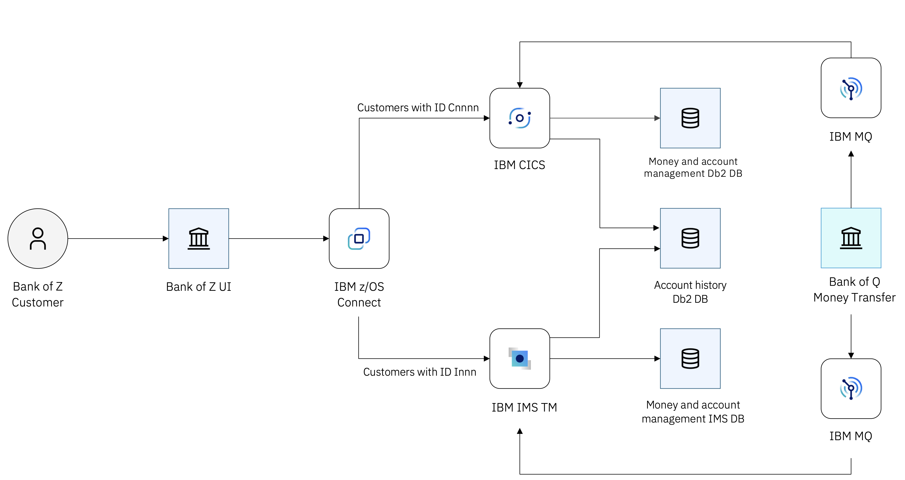

# Bank-of-Z — Fork con Bridge de Modernización IBM Bob 2.0

> Fork del repositorio oficial [IBM/Bank-of-Z](https://github.com/IBM/Bank-of-Z).
> Este fork añade un bridge funcional que conecta z/OS Connect Designer
> con un backend Java moderno, eliminando la dependencia de mainframe físico
> para desarrollo y pruebas.

## ¿Qué añade este fork?

### Bridge z/OS Connect → Java backend (sin mainframe)

El repo original requiere un mainframe IBM Z con CICS/IMS activos.
Este fork incluye la infraestructura para reemplazar esos servicios
con un backend Java (Open Liberty + MicroProfile) durante el desarrollo:

```
┌─────────────────┐     HTTP      ┌──────────────────────┐
│  z/OS Connect   │ ──────────── ▶│  Open Liberty :9080  │
│  Designer :9090 │  (bridge)     │  Jakarta EE 10       │
│  (Docker)       │               │  MicroProfile 6.1    │
└─────────────────┘               └──────────────────────┘
         ▲
         │ OpenAPI UI
    localhost:9090
```

### Archivos añadidos / modificados

| Archivo | Cambio |
|---|---|
| `docker-compose.yaml` | Puerto 9080→9090, `extra_hosts: host-gateway` |
| `src/api/src/main/liberty/config/java-backend.xml` | Nuevo — HTTP Service Provider |
| `src/api/src/main/liberty/config/server.xml` | Feature `httpServiceProvider-1.0` |
| `src/api/src/main/operations/*/operation.yaml` (×11) | `zasset: CICS` → `httpServiceProvider` |
| `src/frontend/server.js` | Proxy reescribe rutas al contexto Java |
| `src/frontend/config.js` | URLs relativas, sortCode 123456 |

## Levantar el stack completo

```bash
# 1. Backend Java (Open Liberty)
cd /ruta/a/bankofz-hackathon-2026/output/java
mvn liberty:run

# 2. z/OS Connect + Frontend (en otro terminal)
cd /ruta/a/Bank-of-Z
docker compose up
```

| URL | Descripción |
|---|---|
| http://localhost:3001 | Frontend Bank-of-Z |
| http://localhost:9090/openapi/ui | z/OS Connect Designer |
| http://localhost:9080/openapi/ui | Open Liberty (Java backend) |

## Créditos

- Modernización generada con **IBM Bob 2.0** (Agent Mode + subagentes paralelos)
- Repo original: [IBM/Bank-of-Z](https://github.com/IBM/Bank-of-Z) — Apache 2.0
- Fork: Jorge Hernandez — Mainframe Modernization Architect
___________

# Bank of Z

Bank of Z is a hybrid banking application that demonstrates modern IBM Z development practices. It routes transactions through CICS or IMS depending on customer ID, with z/OS Connect as the API gateway between the browser-based UI and the z/OS transactional applications.

Full documentation is available at **[https://ibm.github.io/Bank-of-Z/](https://ibm.github.io/Bank-of-Z/)**.

## Architecture



For a detailed walkthrough of components and request flows, see the [Architecture docs](https://ibm.github.io/Bank-of-Z/docs/architecture/).

## Getting Started

> **New here? Start with the [Installation Overview →](https://ibm.github.io/Bank-of-Z/docs/installation-and-setup/)**

Or follow the full setup path step by step:

| Step | Link |
|------|------|
| 1. Review prerequisites | [Prerequisites](https://ibm.github.io/Bank-of-Z/docs/installation-and-setup/prerequisites) |
| 2. Configure your environment | [Environment Configuration](https://ibm.github.io/Bank-of-Z/docs/installation-and-setup/environment-configuration) |
| 3. Set up local tools | [Local Tools Setup](https://ibm.github.io/Bank-of-Z/docs/installation-and-setup/local-tools/) |
| 4. Deploy Bank of Z | [Deploying Bank of Z](https://ibm.github.io/Bank-of-Z/docs/installation-and-setup/deploying) |
| 5. Follow a tutorial | [Tutorials](https://ibm.github.io/Bank-of-Z/docs/tutorials/) |

## Documentation

| Topic | Description |
|-------|-------------|
| [About Bank of Z](https://ibm.github.io/Bank-of-Z/docs/about-bank-of-z/) | Purpose, capabilities, and architecture overview |
| [Architecture](https://ibm.github.io/Bank-of-Z/docs/architecture/) | Components, request flows, and external integrations |
| [Installation Overview](https://ibm.github.io/Bank-of-Z/docs/installation-and-setup/) | Installation workflow and stages |
| [Prerequisites](https://ibm.github.io/Bank-of-Z/docs/installation-and-setup/prerequisites) | Local and z/OS software requirements |
| [Environment Configuration](https://ibm.github.io/Bank-of-Z/docs/installation-and-setup/environment-configuration) | Zowe profile setup and connectivity |
| [Local Tools Setup](https://ibm.github.io/Bank-of-Z/docs/installation-and-setup/local-tools/) | IDE, Zowe CLI, and GRUB setup |
| [Deploying Bank of Z](https://ibm.github.io/Bank-of-Z/docs/installation-and-setup/deploying) | Build the application and deploy to z/OS |
| [Development Workflows](https://ibm.github.io/Bank-of-Z/docs/development-workflows/) | Zowe CLI and GRUB workflow guides |
| [Tutorials](https://ibm.github.io/Bank-of-Z/docs/tutorials/) | Deploy Bank of Z, CICS enhancement scenario |
| [Reference](https://ibm.github.io/Bank-of-Z/docs/reference/) | Commands, configuration, repository structure, glossary |
| [Troubleshooting](https://ibm.github.io/Bank-of-Z/docs/troubleshooting/) | Common issues and solutions |

## Contributing

This is a sample application for demonstration purposes. Feel free to fork the repository, customise it for your environment, add new features or programs, and share improvements.

## License

Licensed under the Apache License, Version 2.0. See [LICENSE](LICENSE) for details.
